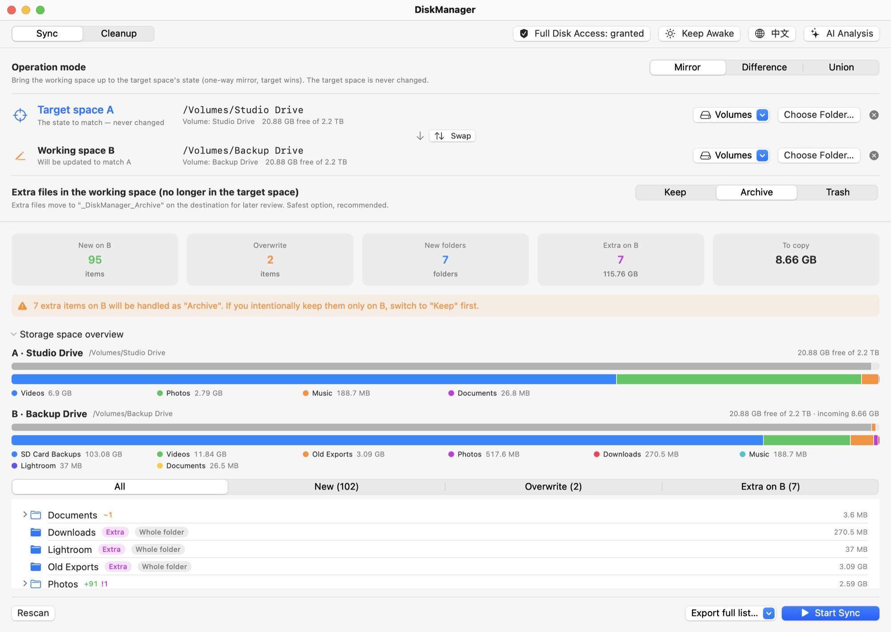
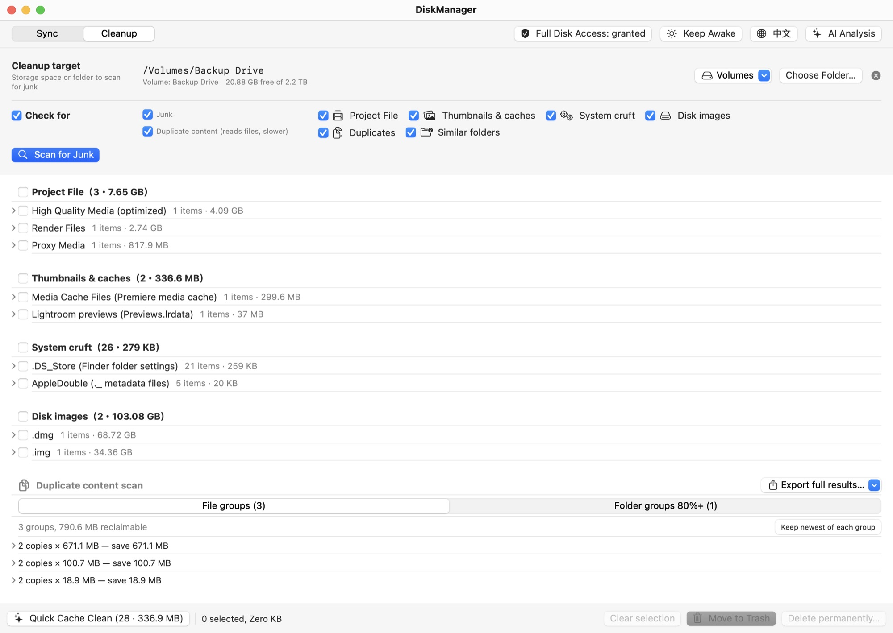
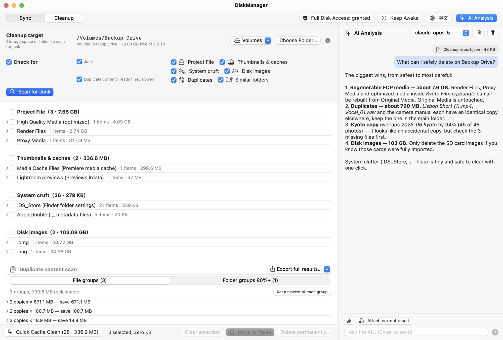

# DiskManager

  

A native macOS app (SwiftUI) to compare, sync and clean up two storage locations — external drives, local folders, or any two folders. It was originally built to manage two external drives kept in different places (A: 8 TB, B: 10 TB) that only occasionally get plugged into the same Mac. The UI is bilingual (Traditional Chinese / English) and can be switched live from the toolbar.

**[Website](https://disk-manager.derekdylu.com/)** · **[Download for Mac](https://github.com/derekdylu/DiskManager/releases/latest)** · [Install guide](https://disk-manager.derekdylu.com/#install)

<picture>
  <source media="(prefers-color-scheme: dark)" srcset="docs/assets/shots/en-dark-sync.jpg">
  
</picture>

## Download & install

1. Download the latest `DiskManager-<version>.zip` from [Releases](https://github.com/derekdylu/DiskManager/releases), unzip it and drag `DiskManager.app` into Applications.
2. The app is not notarized by Apple, so Gatekeeper blocks it on first launch:
   - **macOS 15 Sequoia and later**: open the app once and dismiss the warning, then go to **System Settings › Privacy & Security**, scroll to **Security** and click **Open Anyway**.
   - **macOS 14 Sonoma**: in Finder, **right-click the app › Open**, then click **Open**.
   - **Any version**: remove the quarantine flag in Terminal:

     ```bash
     xattr -dr com.apple.quarantine /Applications/DiskManager.app
     ```

3. Enable DiskManager under **System Settings › Privacy & Security › Full Disk Access** (see [Permissions](#permissions-full-disk-access) below).

The [website](https://disk-manager.derekdylu.com/#install) has the full step-by-step install guide.

Requirements: macOS 14 Sonoma or later, Apple Silicon. You can also build from source (see [Building](#building)).

## Sync tab

The layout has three rows, top to bottom: **mode** → **target space A** (the source of truth; never modified, highlighted with the accent color) → **operated space B** (the side that gets changed). For the opposite direction, press the "Swap" button between the two rows — existing scan results are reused, no rescan needed. That is why there are no mirrored duplicate modes such as B→A or A−B. In union mode both sides are equal and neither is highlighted.

Three modes (switch instantly; the plan is recomputed from cached scan results without rescanning):

| Mode | Behavior |
|---|---|
| **Mirror** | Make operated space B match target space A (one-way mirror with A as the source of truth) |
| **Difference** | Preview only the items that exist in B but not in A, then archive them or move them to the Trash after confirmation; nothing is copied or overwritten |
| **Union** | Fill in missing files on both sides; when the same file differs, the one with the newer modification time wins and the overwritten version is archived first. Items whose age can't be determined, or that conflict in type, are **left untouched and listed** |

In mirror mode, extra files on the operated space are handled as you choose: **keep**, **move to archive folder** (default), or **move to Trash**.

Changing folder A or B after a plan has been previewed invalidates the plan immediately; you must rescan before running it.

### Preview

- Scanning and comparing are strictly read-only; you get the full plan before pressing "Start Sync".
- **Tree diff list**: expand and collapse folders like a file browser. Folders show aggregated size and +add / ~overwrite / !extra counts. Filter by action, and export the full list as JSON or plain text.
- **Storage visualization**: usage bars for both spaces (including the bytes this run will write — turns red and blocks the sync when space is insufficient), plus a size breakdown of the top-level folders in the scanned range.

### Safety

- Nothing is ever deleted outright: extra or replaced files go to `_DiskManager_Archive/<timestamp>/` by default.
- Atomic overwrites (temp file + rename), so cancelling mid-way never leaves a half-written file. Files locked in Finder are temporarily unlocked for the replace, then the flag is restored.
- Modification times and metadata are preserved; on exFAT it falls back to data + timestamps, with a 2-second tolerance when comparing times.
- Filename case is handled according to each side's file system, so `Folder` / `folder` are not treated as two different items on case-insensitive volumes.
- System sleep is prevented during scans and syncs; the toolbar also has a "Keep screen on" toggle.

## Cleanup tab

<picture>
  <source media="(prefers-color-scheme: dark)" srcset="docs/assets/shots/en-dark-cleanup.jpg">
  
</picture>

Finds removable junk in a storage space. Everything is listed for you to check first; items go to the Trash by default, and permanent deletion needs an extra confirmation.

- **Project files (regenerable FCP / iMovie media)**: Render Files, Proxy Media, High Quality Media, and Peaks / Analysis / Thumbnail caches inside `.fcpbundle` / `.imovielibrary` libraries. **Original Media is never included.**
- **Disk images**: `.img` / `.dmg` / `.iso` / `.sparseimage`, etc. (e.g. SD card backup images) — whether to delete them is up to you.
- **System clutter**: `.DS_Store`, AppleDouble (`._` files, picked up with a POSIX `readdir` pass because Foundation APIs hide them), Spotlight indexes, `.fseventsd`, and leftover `.dmtmp-*` temp files from interrupted copies in older versions.
- **Thumbnails & caches**: `.thumbnails`, Lightroom `Previews.lrdata`, Premiere Media Cache, etc.
- **Duplicate files**: files ≥ 10 MB are grouped by "size + SHA-256 fingerprint of the first and last 1 MiB", with a one-click "keep the newest in each group".
- **Similar folders**: the duplicates section switches between "file groups" and "folder groups". A folder needs at least 5 files and ≥ 80% recursive content-fingerprint overlap to be listed as a candidate. Shared file count, size, and both folders' total file counts are shown so you can compare and check one of them. Parent/child folders are never paired. The section still shows scan status when there are no candidates.
- **Export**: the whole scan report can be exported as JSON (handy for AI or scripted analysis). Duplicates can additionally be exported as TSV with every duplicate-file group, similar-folder group, similarity, fingerprint, size, modification time and full relative path — not limited to the 100 groups shown in the UI.
- **Checks**: before scanning, choose which categories to check (one row for junk, one for duplicate detection). The checkbox at the start of each row toggles the whole row, and the one on the "Checks" header toggles everything. Duplicate detection reads files to compute fingerprints, so leave it off when you don't need it.
- **One-click cache cleanup**: in the action bar after a scan completes, moves all system clutter + thumbnail caches found in this scan to the Trash after a single confirmation, without checking items one by one.

Each category is further grouped into **subcategories** (e.g. system clutter → `.DS_Store` / AppleDouble / Spotlight index …), each with its own count, size and group checkbox; individual files appear only when expanded, so you won't drown in thousands of `.DS_Store` files.

The junk scan skips `_DiskManager_Archive` (the safety net) and `.Trashes`.

## AI analysis (chat panel)

<picture>
  <source media="(prefers-color-scheme: dark)" srcset="docs/assets/shots/en-dark-chat.jpg">
  
</picture>

"AI Analysis" in the toolbar opens a chat panel on the right where you can hand results to an LLM for analysis (which folders take the most space, whether extra files are safe to delete, which duplicate to keep …):

- **Bring your own API key**: switch between **Claude (Anthropic)** and **GPT (OpenAI)** and paste the matching API key via the key icon. Keys are stored only in the macOS Keychain and are only sent to `api.anthropic.com` / `api.openai.com`; usage is billed to your own account. The model picker lists both providers' models (in Claude / GPT sections), and the provider's key is chosen by the model you pick. Default: `claude-opus-5`.
- **Attach current results**: converts the on-screen sync plan or cleanup report to JSON and attaches it. Lists over 1,000 entries include only the 1,000 largest and say so explicitly; per-folder / per-category totals remain complete.
- **Paperclip**: attach a previously exported JSON / XML / TSV / TXT file. Attachments are limited to 1 MB each; larger files are rejected with an explanation rather than silently truncated.
- Attachment contents (including file paths) are sent to the Anthropic / OpenAI API you choose. The AI only gives advice — it does not and cannot modify any files.

## Building

```bash
make app        # builds build/DiskManager.app (drag it into Applications); icon comes from scripts/AppIcon.png
```

### Permissions: Full Disk Access

macOS doesn't let apps request Full Disk Access themselves; you have to enable DiskManager under **System Settings › Privacy & Security › Full Disk Access** (then relaunch the app). Without it, scanning triggers a separate prompt for Desktop / Documents / Downloads / external and network volumes, and protected folders are skipped. The shield icon on the right of the toolbar shows the current status and opens that settings pane when clicked; the first scan also reminds you if access hasn't been granted.

`make app` automatically signs with an installed Apple Development / Developer ID identity (override with `CODESIGN_IDENTITY=`). This matters: Full Disk Access is tied to the app's code signature. An ad-hoc signature changes on every build, so macOS silently revokes the grant; with a real identity the grant survives rebuilds.

## Development

```bash
xed .           # open in Xcode (SPM package)
swift run       # run directly
swift test      # unit tests (scan / diff / difference / union / junk scan / similar folders / end-to-end sync)

# Scale smoke test (generates 80k files to measure scan memory; slow, skipped by default)
DM_SCALE_TEST=1 swift test --filter ScaleSmokeTests
```

Note: every scan / copy / delete loop must wrap each item in `autoreleasepool`. Foundation's enumeration and file APIs create lots of autoreleased objects, and background threads have no drain point, so memory grows without bound on large drives (measured: +43 MB for 80k files; several GB before the fix).

Layout:
- `Sources/DiskManagerCore/` — pure logic, UI-independent, fully testable:
  - `TreeScanner` scanning, `Differ` mirror/union diffing, `SyncEngine` execution, `CopyFile` (a `copyfile(3)` wrapper with progress, cancellation and metadata)
  - `JunkScanner` junk classification + duplicate fingerprints, `JunkEngine` deletion
  - `ReportJSONExporter` JSON export of sync plans / cleanup reports (full version for saving, capped version for the AI)
- `Sources/DiskManager/` — SwiftUI UI (bilingual strings are written inline in pairs as `tr(zh, en)`); the AI chat panel is `ChatPanelView` / `ChatState` / `ClaudeClient` + `OpenAIClient` (each using its provider's streaming API, no third-party dependencies) / `KeychainStore`

### Designed for more than two drives

The core APIs work on "any two folder URLs" (`Differ.diff(source:dest:)`, `SyncEngine.execute(...)`) and have no notion of A/B. Extending to N drives only requires a drive list plus pairwise runs at the UI layer; the core stays unchanged. Combined with the manifest database on the roadmap (recording which files are backed up to which drive), this enables scenario 1 and multi-drive setups.

## Known limitations

- Sync comparison uses size + modification time, not full-file hashes; duplicate detection uses head/tail fingerprints (labeled "very likely duplicate").
- Folder modification times are not synced.
- AppleDouble (`._`) files are not synced (Foundation enumeration doesn't return them; they are metadata sidecars that `copyfile` recreates when needed). The cleanup tab can find and delete them.
- Union mode never touches conflicts whose age can't be determined; they need manual handling.

## Roadmap

- **Scenario 1**: local files may only be deleted safely once they are backed up to both A and B — this needs a manifest database so the app can tell which backups a batch of files is still missing even when only one drive is connected.
- Sync across N drives.
- Optional content verification (checksums) before syncing; sync history.

## License

[MIT](LICENSE)
